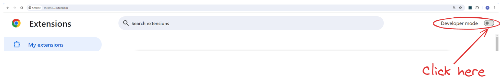
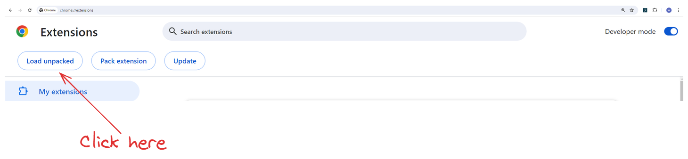
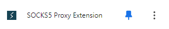
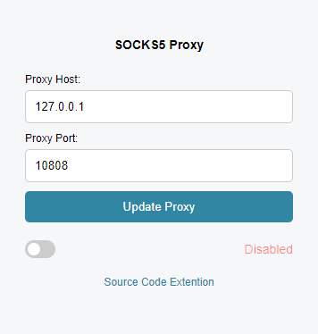
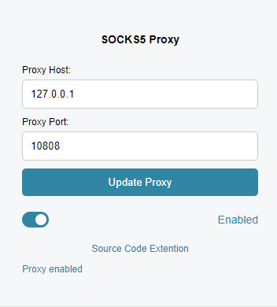
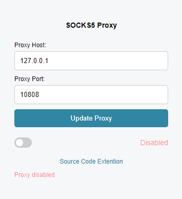

## SOCKS5 Proxy Extention for Chrome

### About
> About
> These are extensions for browsers running on the chromium engine. The extension was tested on **Google Chrome Version 126.0.6478.128 (Official build), (64 bit)**.
> 
> This extension is designed to connect chrome browser via **SOCKS5** proxy server (**Only SOCKS5 support is available**).

### Quick start

> - Download source code
> - Go [chrome://extensions](chrome://extensions)
> - In the upper right corner, enable **dev mode**
> - 
> - On the top left, click on the **“Load unpacked”** button
> - 
> - Select the folder you downloaded from github **“socks5-proxy-extension”**
> - The extension will be downloaded - click on the icon
> - 
> - In the field **“Proxy Host:”** specify IP server, if the client for SOKCS5 (Shadowsocks or V2RayNG) is installed on PC - then the local server address is 127.0.0.1.
> - In the **“Proxy Port:”** field specify the server Port (usually it is specified in your SOCKS5 client).
> - 
> - Next, turn on the checkbox (slider) at the bottom left of the window - it will be colored and click on the “Update Proxy” button. The status will change from **“Disabled”** to **“Enabled”**.
> - 
> - To disable - turn off the checkbox (slider) at the bottom left of the window and click the “Update Proxy” button. The status will change from **“Enabled”** to **“Disabled”**.
> - 
> - Each time you change the **“Proxy Host:”** or **“Proxy Port:”** fields, click the **“Update Proxy”** button.